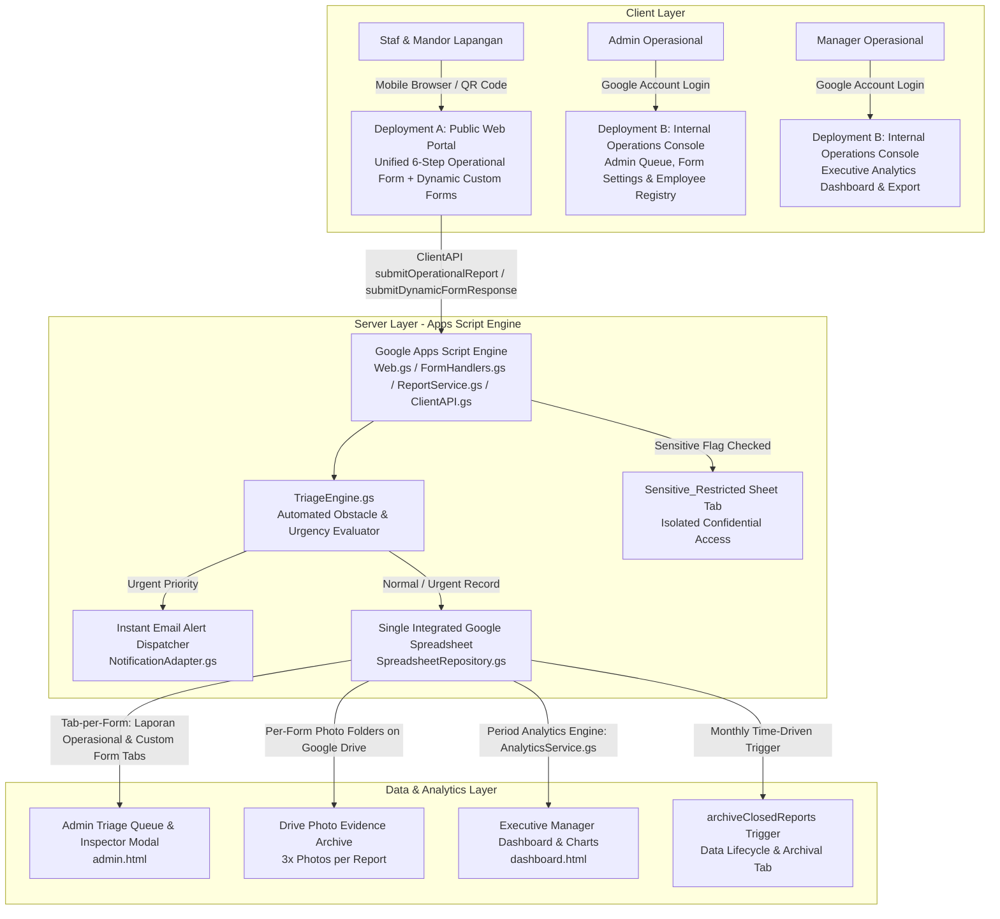

# Sistem Lapor MPL — Integrated Agriculture Reporting System


A zero-budget, modern digital reporting system engineered for an integrated agriculture enterprise in Indonesia (Farming, Livestock, Processing Plant, Logistics & End-Products). Replaces traditional manual paper reports with a mobile-first Web App portal, dynamic 6-step operational reporting wizard, live hybrid camera capture, form blueprint manager, automated triage engine, sensitive data isolation, strict Role-Based Access Control (RBAC), and real-time executive dashboards.

---

## 🏗️ System Architecture



---

## 📁 Repository Structure

```
MPL_sistem_lapor/
├── package.json               # Node.js dev dependencies & clasp CLI scripts
├── .clasp.json.template       # Clasp deployment configuration template
├── CONFIG.md                  # Operational parameters, site registry & keyword rules
├── README.md                  # System architecture, deployment guide & technical reference
├── src/
│   ├── appsscript.json        # Apps Script manifest (Asia/Jakarta timezone, scopes & webapp config)
│   ├── Setup.gs               # Spreadsheet, Google Drive folders & initial schema provisioning
│   ├── Automation.gs          # Time-driven cron trigger delivery entry points
│   ├── AdminService.gs        # Unified Application Facade coordinating admin workflows
│   ├── AdminQueueService.gs   # Operational review queue, verification & inspector lookups
│   ├── EmployeeService.gs     # Master employee registry, delegation rules & division policies
│   ├── MaintenanceService.gs  # Automated daily/weekly email digests & 90-day storage retention
│   ├── SecurityService.gs     # Rate limiting, RBAC guards, input sanitization & formula neutralization
│   ├── AnalyticsService.gs    # Executive analytics computations, harvest yields & revenue trends
│   ├── AuthService.gs         # RBAC identity evaluation, deployment isolation & session security
│   ├── ReportService.gs       # Report submission coordinator, photo upload & dynamic form intake
│   ├── FormManagementService.gs # Form schema registry CRUD, step builders & tab-per-form provisioning
│   ├── SpreadsheetRepository.gs # DAO repository for integrated spreadsheet operations & GID lookups
│   ├── ConfigRepository.gs    # Centralized Script Properties & environment configuration wrapper
│   ├── DomainEntities.gs      # Domain data models, employee master registry & severity constants
│   ├── TriageEngine.gs        # Pure obstacle evaluator & severity classifier
│   ├── NotificationAdapter.gs # Instant HTML email alert dispatcher & digest builders
│   ├── FormHandlers.gs        # Native Google Form trigger handlers
│   ├── Triggers.gs            # Time-driven and event trigger management
│   ├── Utils.gs               # Pure utility helpers (date/phone formatting, rupiah, ISO week)
│   ├── PortfolioSeedGenerator.gs # 96-record multi-month synthetic operational data seed generator
│   ├── Web.gs                 # HTTP doGet router, role delivery & HTML template evaluation
│   ├── ClientAPI.gs           # Server RPC gateway (google.script.run bridge with security guards)
│   │
│   ├── index.html             # Public Unified Operational Reporting Form with camera capture
│   ├── camera.html            # Standalone pop-up WebRTC camera fallback page
│   ├── dynamicform.html       # Public Dynamic Custom Form intake view (supports dynamic fields & photos)
│   ├── admin.html             # Internal Admin Queue view (Inspector modal, search, filters & CSV export)
│   ├── dashboard.html         # Executive Manager Analytics Dashboard (KPIs, Yields, Revenue & Trends)
│   ├── employees.html         # Internal Employee Master Settings (ID Prefix, Division & PIC SGA 2-Tier)
│   ├── forms.html             # Form Schema Blueprint Manager (Lokasi, Tindakan, Komoditas, Custom Questions)
│   ├── roles.html             # Superadmin Role & Access Permission management view
│   ├── brand.html             # Master SVG brand mark and corporate wordmark partial
│   ├── header.html            # Public form display-only header partial & user identity strip
│   ├── sidebar.html           # Internal Operations Console sidebar navigation with integrated brand header
│   ├── style.html             # Design token stylesheet (CSS variables, buttons, modals, toasts, badges)
│   └── app.html               # Client JS bridge, toast notifications, export utilities & guide modals
└── docs/
    ├── USER_GUIDE_DAILY_REPORT.md # Field staff step-by-step reporting guide
    ├── ADMIN_MANUAL.md        # Admin runbook & queue management guide
    ├── CONSENT_NOTICE_UU_PDP.md   # Plain-language Indonesia UU PDP privacy notice
    └── SECURITY_AUDIT_REPORT.md   # Comprehensive enterprise cybersecurity & RBAC audit report
```

> 💡 **Single Source of Truth**: All operational source code lives exclusively in `src/`. Running `npm run push` deploys `src/` directly to Google Apps Script.

---

## 🚀 Quick Setup & Deployment Guide

### Step 1: Prerequisites & Dependencies
1. A Google Workspace or Gmail account designated for the enterprise reporting system.
2. Enable Google Apps Script API at [script.google.com/home/usersettings](https://script.google.com/home/usersettings).
3. Install project dependencies locally:
   ```bash
   npm install
   ```

### Step 2: Google Authentication & Clasp Setup
```bash
# Login to Google Account via Clasp CLI
npx clasp login

# Initialize standalone Apps Script project (or configure .clasp.json with your Script ID)
npx clasp create --type standalone --title "Sistem Pelaporan MPL" --rootDir src
```

### Step 3: Push Code & Provision System
```bash
# Deploy code to Google Apps Script
npm run push

# Open the Apps Script Web Editor
npm run open
```
In the Apps Script web editor:
1. Open `Setup.gs`.
2. Run `setupReportingSystem()` to automatically create the Integrated Spreadsheet, Drive photo folders, and initial sheet tabs.
3. Check the **Execution Log** for the generated `SPREADSHEET_ID` and `MAIN_FORM_ID`.

---

## ⚙️ Script Properties Configuration

In the Apps Script Editor, go to **Project Settings** (⚙️) → **Script Properties** and configure the following parameters:

| Property Name | Required | Example / Description |
|---|---|---|
| `PORTFOLIO_MODE` | Optional | Set to `true` (default) for portfolio showcase demonstration mode; set to `false` for strict enterprise corporate production. |
| `ADMIN_EMAIL` | **Yes** | Active Admin Google email (e.g. `yourname@gmail.com`). Receives instant urgent notifications. |
| `MANAGER_EMAIL` | **Yes** | Active Executive Manager Google email. Receives weekly digests and accesses Analytics. |
| `SPREADSHEET_ID` | **Yes** | ID of the single integrated Google Spreadsheet (auto-generated by `Setup.gs`). |
| `MAIN_FORM_ID` | **Yes** | ID of the Unified Operational Google Form (auto-generated by `Setup.gs`). |
| `REGISTERED_FORMS_JSON` | **Auto** | JSON array of all registered dynamic custom forms, tab GIDs, and Drive photo folders. |
| `PUBLIC_WEB_APP_URL` | **Yes** | Web App URL of **Deployment A** (Public Access). Aliased by `PUBLIC_URL`. |
| `INTERNAL_WEB_APP_URL` | **Yes** | Web App URL of **Deployment B** (Internal Operations Console). Aliased by `INTERNAL_URL`. |
| `RETENTION_DAYS` | Optional | Archival threshold in days for `archiveOldReports()`. Defaults to `90` days. |

---

## 🌐 Dual Web App Deployment Model

To ensure zero friction for field staff on mobile devices while securing internal management data, deploy two Web App instances from the same script project:

### Deployment A — Public Portal (Field Staff & Public Intake)
- **Deploy** → **New deployment**
- **Type**: `Web app`
- **Description**: `Deployment A — Public Field Staff Intake`
- **Execute as**: `Me`
- **Who has access**: `Anyone` *(No Google login required for external evaluators and field workers)*
- **Landing**: Directly loads the Unified Operational Reporting Form (`index.html`) or Dynamic Custom Forms (`dynamicform.html`).

### Deployment B — Internal Operations Console (Admin & Executive Manager)
- **Deploy** → **New deployment**
- **Type**: `Web app`
- **Description**: `Deployment B — Internal Operations Console`
- **Execute as**: `Me`
- **Who has access**: `Anyone` *(In portfolio mode for showcase evaluation; in enterprise production: `Anyone with Google account`)*
- **Landing**: Automatically lands on the **Executive Manager Dashboard** (`dashboard.html`), with direct navigation to **Antrean Admin** (`?page=admin`), **Pengaturan Karyawan** (`?page=employees`), **Pengaturan Form** (`?page=forms`), and **Hak Akses & Role** (`?page=roles`).

> ⚠️ **Configuration Step**: Copy both Web App URLs into `PUBLIC_URL` and `INTERNAL_URL` in **Script Properties** so cross-deployment routing and inter-module links resolve correctly.

---

## ⚡ Core Features & Technical Capabilities

### 1. Unified 6-Step Operational Reporting Wizard (`index.html`)
- **Step 1: PIC & Site Identity**: Selects verified Employee ID with automatic name/division lookup, activity selection (Tanam/Tebar, Panen/Jual, Pengawasan, Administrasi), and site location.
- **Step 2: Planting / Seeding (Conditional)**: Records commodity, land area ($m^2$/Ha), seed quantity, and planting status.
- **Step 3: Harvest & Sales (Conditional)**: Captures harvest quantity (Kg), unit price, total revenue (Rp), buyer details, and logistics channel.
- **Step 4: Supervision & Field Activities**: Tracks supervision actions, office admin notes, obstacles, and immediate mitigation attempts.
- **Step 5: Hybrid Camera Documentation**: Captures 3 required photos (Activity, Yield/Product, Team Documentation) with client-side JPEG compression, EXIF removal, and date/time watermarks.
- **Step 6: Review & Final Submission**: Real-time review summary with a 3-column single-row mobile photo grid before submission.

### 2. Hybrid Camera & 3-Photo Verification Architecture
- **Three Mandatory Photos**: Requires 3 distinct operational photos (Foto 1: Utama, Foto 2: Detail Aktivitas, Foto 3: Hasil / Area). Authoritatively enforced at the backend by `ReportService.submitOperationalReport()`.
- **Mobile Devices (Smartphones)**: Directly launches the native camera shutter via `<input type="file" accept="image/*" capture="environment">` for seamless 1-tap capture without WebRTC permission friction.
- **Desktop Browsers (Apps Script Sandboxed Iframe)**: Detects restricted iframe Permissions Policy context and routes directly to the local file selector fallback, preventing `NotAllowedError` violations while applying client-side JPEG compression, EXIF removal, and tamper-evident timestamp watermarking.
- **Standalone / External WebRTC Camera**: Supports dedicated external HTTPS camera window (`camera.html`) returning captured photos via structured, validated `postMessage` payloads.

### 3. Employee Master & 2-Tier SGA Role Structure (`employees.html` & `DomainEntities.gs`)
- **Management (`MNJ-01`..`09`) & Alprof (`ALP-01`..`07`)**: Full direct reporting permissions (`isPic: true`).
- **PIC SGA (`SGA-01` Wayan Darmawan & `SGA-02` Made Suardika)**: Designated PICs with exclusive authorization to submit official operational reports for the SGA division and record team attendance.
- **SGA Field Members (`SGA-03`..`12`)**: Field team members whose attendance is logged via PIC SGA.
- **Employee Settings Console**: Real-time CRUD interface with auto-increment ID generation, division filters, and `PIC SGA` badge indicators (`badge-div-pic-sga`).

### 4. Form Blueprint & Schema Manager (`forms.html`)
- Visual form builder allowing admins to configure active options for **Lokasi**, **Tindakan Pengawasan**, **Komoditas Pertanian**, and **Status Pengelolaan**.
- Supports adding dynamic custom fields across Steps 1 through 5.
- Real-time schema synchronization with draft status detection and reset capabilities.

### 5. Automated Triage Engine (`TriageEngine.gs`)
- Evaluates field reports for operational obstacles (`Kendala Kegiatan`).
- Reports with verified obstacles are automatically tagged as **`Urgent`** and trigger instant email alerts to `ADMIN_EMAIL`.
- Standard operational reports are classified as **`Normal`**.

### 6. Executive Manager Analytics Dashboard (`dashboard.html` & `AnalyticsService.gs`)
- **Period Filter Engine**: Computes KPIs across `This Week`, `Last Week`, `This Month`, `This Quarter`, `This Year`, or custom date ranges.
- **Key Metrics**: Harvest volume (Kg), gross sales revenue (Rp), average price realization, planting area coverage, and active field workers.
- **Visual Analytics**: Interactive commodity breakdown charts, revenue trends, and operational obstacle tracker.
- **Data Export**: One-click CSV export of filtered analytical datasets.

---

## ⚖️ Legal & Privacy Compliance (UU PDP No. 27 Tahun 2022)

The system adheres to Indonesia's Personal Data Protection Law (**Undang-Undang Nomor 27 Tahun 2022 tentang Pelindungan Data Pribadi**):
- **Data Minimization (Pasal 16)**: Form intake utilizes standardized Employee IDs (`EmpID`) rather than sensitive government ID numbers.
- **Access Control & RBAC (Pasal 35)**: Internal administration consoles are strictly restricted to authenticated operational Google accounts.
- **Confidential Data Isolation**: Reports flagged as *Sensitive* are stored in a segregated `Sensitive_Restricted` tab.
- **Transparent Privacy Consent**: Integrated privacy modal in the reporting form footer with plain-language terms (`docs/CONSENT_NOTICE_UU_PDP.md`).
- **Data Lifecycle & Archival**: Automatic archiving of historical reports older than 90 days (`archiveOldReports`).

---

*Developed for Integrated Agriculture & Agro-Industrial Operations (Planting, Harvest, Livestock, Processing Plant & Logistics).*