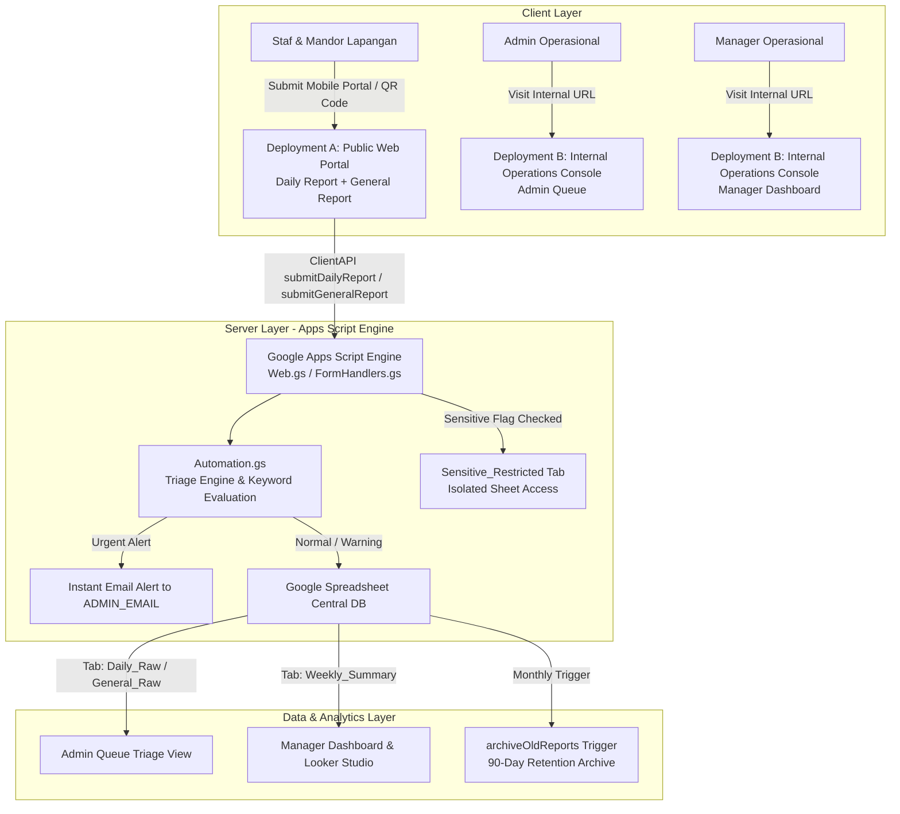

# Sistem Pelaporan Digital — Integrated Agriculture Reporting System


A zero-budget, modern digital reporting system designed for an integrated agriculture enterprise in Indonesia (Farming, Livestock, Processing Plant, Logistics & End-Products). Replaces traditional paper reports with a mobile-first Web App portal, automated triage engine, sensitive data isolation, strict Role-Based Access Control (RBAC), and executive dashboards.

---

## 🏗️ System Architecture



---

## 📁 Repository Structure

```
MPL_sistem_lapor/
├── package.json               # Node & clasp dev dependencies
├── .clasp.json.template       # Clasp deployment configuration template
├── CONFIG.md                  # Operational settings, site lists, & keyword rules
├── README.md                  # System architecture, deployment guide & reference
├── src/
│   ├── appsscript.json        # Apps Script manifest (Asia/Jakarta timezone & scopes)
│   ├── Setup.gs               # Spreadsheet & Google Form provisioning logic
│   ├── Automation.gs          # Triage keyword engine & 90-day data archival (archiveOldReports)
│   ├── FormHandlers.gs        # Form submission handlers & sensitive row routing
│   ├── Notifications.gs       # Urgent alerts, daily admin & weekly manager digests
│   ├── Triggers.gs            # Automated trigger setup (daily digests, weekly summaries, monthly archival)
│   ├── Utils.gs              # Looker Studio aggregation, date helpers, unit tests
│   ├── MockSimulator.gs       # Seed mock test data generator
│   ├── Web.gs                 # HTTP doGet router, RBAC auth, deployment check, includeApp()
│   ├── ClientAPI.gs           # Server RPC bridge for Web App (google.script.run & Quick Links)
│   │
│   ├── index.html             # Public Daily Report Form view
│   ├── general.html           # Public General Report Form view
│   ├── admin.html             # Internal Admin Triage Queue view (Modal detail, search, filter, CSV, Diagnostics)
│   ├── dashboard.html         # Internal Executive Manager Dashboard view (KPIs, Charts, CSV export)
│   ├── header.html            # Shared top navigation header partial & active user identity strip
│   ├── style.html             # Component design tokens, CSS stylesheet, toasts, modals
│   └── app.html               # Client JS bridge, triage helper engine, toast & CSV utilities
└── docs/
    ├── USER_GUIDE_DAILY_REPORT.md # Field staff step-by-step user guide
    ├── ADMIN_MANUAL.md        # Admin runbook & queue management guide
    └── CONSENT_NOTICE_UU_PDP.md   # Plain-language Indonesia UU PDP privacy notice
```

> 💡 **Single Source of Truth**: All code lives exclusively in `src/`. Running `npm run push` deploys `src/` directly to Google Apps Script.

---

## 🚀 Quick Setup & Deployment Guide

### Step 1: Prerequisites & Dependencies
1. A dedicated Google Account created for the company system.
2. Enable Apps Script API at [script.google.com/home/usersettings](https://script.google.com/home/usersettings).
3. Install project dependencies locally:
   ```bash
   npm install
   ```

### Step 2: Google Authentication & Project Creation
```bash
# Login to Google Account via clasp CLI
npx clasp login

# Initialize standalone Apps Script project
npx clasp create --type standalone --title "Reporting System Automation" --rootDir src
```

### Step 3: Push Source Code & Provision Infrastructure
```bash
# Push code to Google Apps Script
npm run push

# Open Apps Script Web Editor
npm run open
```
In the Apps Script editor:
1. Open `Setup.gs`.
2. Run `setupReportingSystem()` to automatically create the Central Spreadsheet, Google Forms, and initial sheet tabs.
3. Check the Execution Log for generated `SPREADSHEET_ID`, `DAILY_FORM_ID`, and `GENERAL_FORM_ID`.

---

## ⚙️ Script Properties Configuration

In the Apps Script Editor, go to **Project Settings** (⚙️) → **Script Properties** and set the following properties:

| Property Name | Required | Example / Description |
|---|---|---|
| `ADMIN_EMAIL` | **Yes** | Active Admin Google account email (e.g. `mpl.sisteminformasi@gmail.com`). Receives urgent alerts. |
| `MANAGER_EMAIL` | **Yes** | Active Manager Google account email. Receives weekly executive digests. |
| `SPREADSHEET_ID` | **Yes** | ID of the central Google Spreadsheet (auto-generated by `Setup.gs`). |
| `DAILY_FORM_ID` | **Yes** | ID of the Daily Google Form (auto-generated by `Setup.gs`). |
| `GENERAL_FORM_ID` | **Yes** | ID of the General Google Form (auto-generated by `Setup.gs`). |
| `PUBLIC_WEB_APP_URL` | **Yes** | Web App URL of **Deployment A** (Public Access). Set after creating Deployment A. |
| `INTERNAL_WEB_APP_URL` | **Yes** | Web App URL of **Deployment B** (Internal Operations Console). Set after creating Deployment B. |
| `RETENTION_DAYS` | Optional | Archive threshold in days for `archiveOldReports()`. Defaults to `90` if unset. |

---

## 🌐 Dual Web App Deployment Model

To maintain zero friction for field staff while strictly securing internal admin functions, deploy two Web App instances from the same Apps Script project:

### Deployment A — Public Portal (Field Staff)
- **Deploy** → **New deployment**
- **Select type**: `Web app`
- **Description**: `Deployment A — Public Field Staff Intake`
- **Execute as**: `Me`
- **Who has access**: `Anyone` *(No Google Login required)*
- **Result**: Field staff land directly on the Daily / General Report forms.

### Deployment B — Internal Operations Console (Admin & Manager)
- **Deploy** → **New deployment**
- **Select type**: `Web app`
- **Description**: `Deployment B — Internal Operations Console`
- **Execute as**: `Me`
- **Who has access**: `Anyone with Google account` *(Enforces Google login)*
- **Result**: Admin and Manager accounts land directly on their role-specific views (`admin.html` or `dashboard.html`).

> ⚠️ **Important Step**: Copy the exact Web App URLs from **Deploy → Manage deployments** into `PUBLIC_WEB_APP_URL` and `INTERNAL_WEB_APP_URL` in Script Properties so deployment detection and quick navigation operate properly.

---

## ⚡ Core Features & Technical Highlights

1. **Zero-Friction Field Intake (`index.html`, `general.html`)**:
   - Mobile-responsive layout, clean form validation, and dynamic issue checkbox selectors.
   - Requires zero login for field staff while tagging submissions with timestamp and Employee ID.

2. **Automated Triage Engine (`Automation.gs`)**:
   - Scans narrative text against Indonesian keyword dictionaries (`urgent` vs `warning` severity).
   - Automatically ranks incidents and dispatches instant email alerts to `ADMIN_EMAIL` for urgent flags (e.g. *kebakaran, kecelakaan, wabah, mati masal*).

3. **Sensitive Data Isolation (`FormHandlers.gs`)**:
   - Reports marked with *Informasi Sensitif?* are isolated exclusively to `Sensitive_Restricted`, keeping confidential reports hidden from standard sheet views.

4. **Strict Per-Role RBAC & Role-Aware Landing (`Web.gs`)**:
   - Gated via `getUserRole()` against `ADMIN_EMAIL` and `MANAGER_EMAIL`.
   - Bare URLs on Deployment B automatically route based on role (`admin` -> Admin Queue, `manager` -> Manager Dashboard).
   - Deployment A attempts to access internal pages are cleanly blocked with an Access Restricted card.

5. **Shared Navigation & Identity Strip (`header.html`)**:
   - Reusable top navigation partial displaying active page context and user login email.

6. **Dynamic Keyword & Variable Injection (`includeApp()`)**:
   - Injects server-authoritative triage keywords and deployment base URLs dynamically without static template evaluation bugs.

7. **In-App Deployment Diagnostics (`admin.html`)**:
   - Collapsible **🔧 Deployment Diagnostics** section in Admin Queue providing live confirmation of execution URLs, deployment IDs, and internal recognition status.

8. **Automated Data Lifecycle (`archiveOldReports`)**:
   - Monthly time-driven trigger archives closed reports older than 90 days into `Archive_Reports`, keeping active sheets fast and lightweight.

---

## 🧪 Testing & Verification Runbook

1. **Syntax Check & Code Push**:
   ```bash
   npm run push
   ```
2. **Keyword Engine Unit Test**:
   - Open Apps Script Editor → `Utils.gs` → Run `testKeywordMatcher()`.
3. **Public Form Submission Test**:
   - Open Deployment A URL → Submit a Daily Report with keyword `kecelakaan`.
   - Verify instant row entry in `Daily_Raw`, `urgent` severity badge, and immediate alert email sent to `ADMIN_EMAIL`.
4. **Sensitive Data Isolation Test**:
   - Open General Report form → Check *Informasi Sensitif?* → Submit.
   - Verify row is saved in `Sensitive_Restricted` tab and excluded from general queue.
5. **Deployment & RBAC Access Verification**:
   - Access bare Deployment B URL signed in as Admin → Verifies automatic landing on Admin Queue (`admin.html`).
   - Expand **🔧 Deployment Diagnostics** card in Admin Queue → Verify `Is Internal: ✅ YES`.
   - Attempt accessing Deployment A with `?page=admin` → Verify restriction card *"Akses Internal Console Tidak Tersedia di Deployment Ini"*.
6. **CSV Data Export Test**:
   - In Admin Queue, click **Export CSV** → Verifies client-side CSV generation.
   - In Manager Dashboard, click **Export Summary CSV** → Verifies executive summary export.

---

## ⚖️ Legal & Privacy Compliance (UU PDP)

This technical architecture addresses data protection requirements under Indonesia's **Undang-Undang Nomor 27 Tahun 2022 tentang Pelindungan Data Pribadi (UU PDP)**:
- **Data Minimization**: Uses Employee IDs (`EmpID`) rather than full personal identity records.
- **Access Limitation & Isolation**: Dedicated `Sensitive_Restricted` tab ensures sensitive field reports are isolated.
- **RBAC Enforcement**: Admin Queue and Manager Dashboard views are restricted to authorized operational emails.
- **Staff Consent Notice**: Includes `docs/CONSENT_NOTICE_UU_PDP.md` for posting at operational sites.

---

*Note: Built for Integrated Agriculture Operations (Farming, Livestock, Processing Plant, Logistics).*