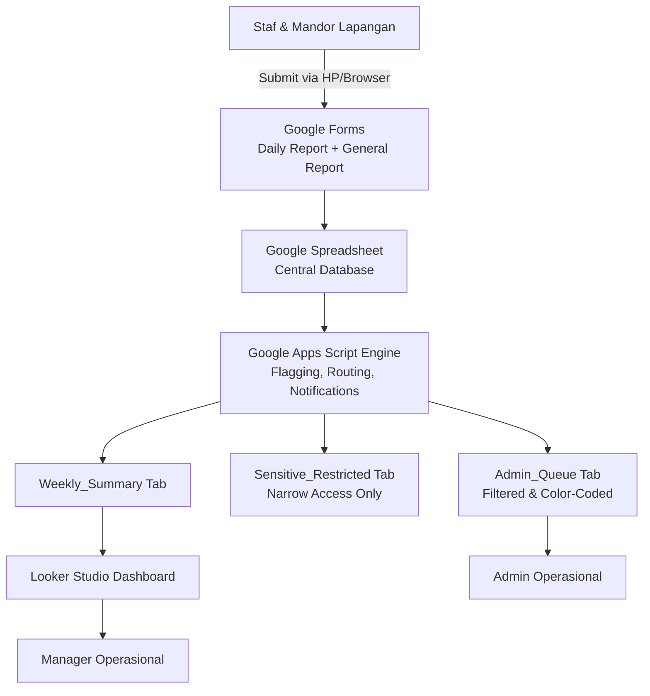

# Sistem Pelaporan Digital — Integrated Agriculture Reporting System


A zero-budget, modern digital reporting system designed for an integrated agriculture business in Indonesia (Farming, Livestock, Processing Plant, Logistics & End-Products). Replaces traditional daily paper reports with an automated, low-friction mobile workflow, automated triage engine, sensitive data isolation, and executive dashboards.

---

## 🏗️ System Architecture



---

## 📁 Repository Structure

```
MPL_sistem_lapor/
├── package.json               # Node & clasp dev dependencies
├── appsscript.json            # Apps Script manifest (Asia/Jakarta timezone & scopes)
├── .clasp.json.template       # Clasp deployment configuration template
├── CONFIG.md                  # Operational settings, site lists, & keyword rules
├── README.md                  # Project documentation and developer guide
├── src/
│   ├── Setup.gs               # Spreadsheet & Google Form provisioning logic
│   ├── Automation.gs          # Bahasa Indonesia agriculture triage keyword engine
│   ├── FormHandlers.gs        # Form submission handlers & sensitive row routing
│   ├── Notifications.gs       # Urgent alerts, daily admin & weekly manager digests
│   ├── Triggers.gs            # Automated trigger setup & teardown
│   ├── Utils.gs              # Looker Studio aggregation, date helpers, unit tests
│   ├── MockSimulator.gs       # Seed mock test data generator
│   ├── Web.gs                 # Web App HTTP doGet router & access control
│   └── ClientAPI.gs           # Server RPC bridge for Web App (google.script.run)
├── docs/
│   ├── USER_GUIDE_DAILY_REPORT.md # Field staff step-by-step user guide
│   ├── ADMIN_MANUAL.md        # Admin runbook & queue management guide
│   └── CONSENT_NOTICE_UU_PDP.md   # Plain-language Indonesia UU PDP privacy notice
└── web/                       # Mobile-first Web App frontend (live Web App + local preview)
```

> 💡 **Dual Intake Architecture**: Field staff can submit reports via the primary **Apps Script Web App** or the backup **Google Forms**. Both intake channels run identical triage flagging and store rows with unique `Report_ID` UUIDs in Google Sheets. The `web/` interface automatically switches to `google.script.run` when deployed live as an Apps Script Web App.

---

## 🚀 Quick Setup & Deployment Guide

### Prerequisites
1. Dedicated Google Account created for the company system.
2. Enable Apps Script API at [script.google.com/home/usersettings](https://script.google.com/home/usersettings).

### Step 1: Local Installation
```bash
# Install dependencies (clasp & Google Apps Script types)
npm install
```

### Step 2: Google Account Authentication & Project Creation
```bash
# Login to company Google account via clasp CLI
npx clasp login

# Initialize standalone Apps Script project
npx clasp create --type standalone --title "Reporting System Automation" --rootDir src
```

### Step 3: Code Deployment
```bash
# Push all source files to Google Apps Script
npm run push

# Open Apps Script Web Editor
npm run open
```

### Step 5: Web App Deployment (Dual Deployment Pattern)
To serve the primary Web App frontend while ensuring security:
1. **Deployment A (Public Intake Forms — Field Staff)**:
   - Click **Deploy** -> **New deployment**.
   - Type: **Web app**.
   - Description: `Public Intake Forms (Field Staff)`.
   - **Execute as**: `Me`.
   - **Who has access**: `Anyone` (No Google login required).
   - *Share this URL with field staff or convert to site QR codes.*

2. **Deployment B (Internal Operations — Admin & Manager)**:
   - Click **Deploy** -> **New deployment**.
   - Type: **Web app**.
   - Description: `Internal Operations Queue & Dashboard`.
   - **Execute as**: `Me`.
   - **Who has access**: `Anyone with Google account`.
   - *Access to `admin.html` and `dashboard.html` is automatically gated by `isAuthorizedStaff()` to `ADMIN_EMAIL` and `MANAGER_EMAIL`.*

---

## 🔒 Human Action Checklist (Non-Automatable Steps)

- [ ] Enable Apps Script API on dedicated Google Account.
- [ ] Run `npx clasp login` and authorize OAuth consent.
- [ ] Deploy Web App **Deployment A** (Public intake, Access: `Anyone`) for field staff.
- [ ] Deploy Web App **Deployment B** (Internal views, Access: `Anyone with Google account`) for Admin & Manager.
- [ ] Print QR Codes / Links for Web App & Google Forms backup at farm/plant sites.
- [ ] Post staff privacy notice (`docs/CONSENT_NOTICE_UU_PDP.md`).
- [ ] *(Optional)* Connect Looker Studio ([lookerstudio.google.com](https://lookerstudio.google.com)) to `Weekly_Summary` tab for deeper ad-hoc analytics.

---

## 🧪 Testing & Verification

1. Run `testKeywordMatcher()` in `src/Utils.gs` from Apps Script editor to verify keyword rules.
2. Submit a test entry in **Daily Report** with an urgent keyword (e.g. `kebakaran` or `rusak berat`). Verify instant email alert to `ADMIN_EMAIL`.
3. Submit a test entry in **General Report** with *Informasi Sensitif?* checked. Verify row moves to `Sensitive_Restricted` and is removed from `General_Raw`.

---

## ⚖️ Legal & Privacy Compliance

This system addresses key technical data protection considerations under Indonesia's **Undang-Undang Nomor 27 Tahun 2022 tentang Pelindungan Data Pribadi (UU PDP)** by implementing data minimization (Employee IDs), restricted access isolation for sensitive reports, and explicit staff privacy notices.

*Note: This technical implementation addresses privacy design considerations; it does not constitute formal legal certification.*